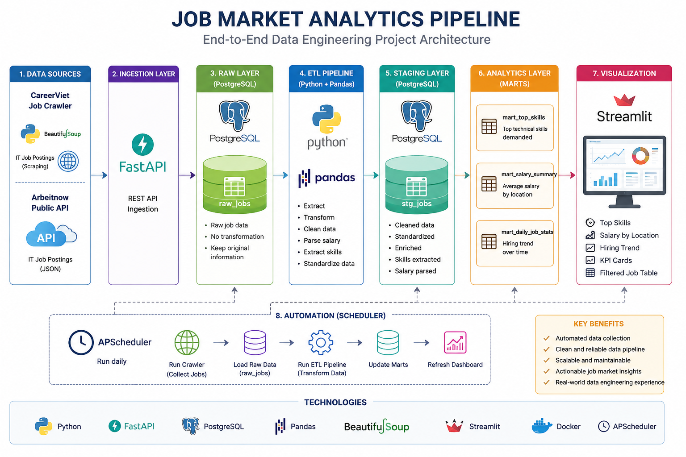
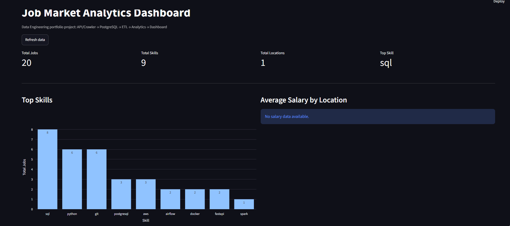

# Job Market Analytics Pipeline

An end-to-end Data Engineering portfolio project that collects IT job postings from public sources, stores raw data in PostgreSQL, transforms them through an ETL pipeline, builds analytics marts, and visualizes insights using Streamlit.

---

## Project Overview

This project simulates a real-world Data Engineering workflow for analyzing the IT job market.

The system automatically collects job postings from online sources, stores them in a raw data layer, performs data transformation, builds analytical datasets, and generates interactive dashboards.

### Key Objectives

* Build a complete data pipeline from ingestion to visualization
* Practice Data Engineering concepts using real-world job data
* Analyze hiring trends and required technical skills
* Create a portfolio project suitable for Data Engineer internships

---

## Architecture



---

## Tech Stack

### Data Ingestion

* Python
* Requests
* BeautifulSoup

### Backend

* FastAPI
* SQLAlchemy

### Database

* PostgreSQL

### Data Processing

* Pandas

### Visualization

* Streamlit
* Plotly

### Infrastructure

* Docker
* Docker Compose

### Scheduling

* APScheduler

---

## Project Structure

```text
job-market-analytics-pipeline/

├── backend/
│   ├── app/
│   └── requirements.txt
│
├── etl/
│   ├── analytics/
│   ├── extract/
│   ├── load/
│   ├── transform/
│   ├── pipeline.py
│   ├── scheduler.py
│   └── requirements.txt
│
├── dashboard/
│   ├── screenshots/
│   ├── streamlit_app.py
│   └── requirements.txt
│
├── docs/
│   └── architecture.png
│
├── docker-compose.yml
├── .env
└── README.md
```

---

## Data Pipeline

### Raw Layer

Table:

```sql
raw_jobs
```

Stores data directly collected from external sources.

### Staging Layer

Table:

```sql
stg_jobs
```

Performs:

* Data cleaning
* Salary parsing
* Location standardization
* Skill extraction

### Analytics Layer

#### mart_top_skills

Top technical skills demanded in the job market.

#### mart_salary_summary

Average salary by location.

#### mart_daily_job_stats

Hiring trend analysis over time.

---

## Features

### Data Collection

* CareerViet crawler
* Public API ingestion
* Incremental data collection

### Data Quality

* Job deduplication using MD5 hash
* Duplicate prevention through unique constraints

### Analytics

* Top skills analysis
* Hiring trend analysis
* Salary analysis

### Dashboard

Interactive Streamlit dashboard including:

* KPI Cards
* Top Skills
* Hiring Trend
* Salary by Location
* Cleaned Job Dataset

### Automation

Daily execution using APScheduler.

---

## Dashboard Preview

### Main Dashboard



---

## How To Run

### 1. Clone Repository

```bash
git clone https://github.com/Kien118/Job-Market-Analytics-Pipeline.git
```

### 2. Create Environment File

Create the local `.env` file from the committed example before starting Docker Compose:

```bash
cp .env.example .env
```

On Windows PowerShell, use:

```powershell
Copy-Item .env.example .env
```

### 3. Start Infrastructure

```bash
docker compose up --build
```

### 4. Run Job Crawler

```bash
cd etl

python ingest_careerviet_jobs.py
```

### 5. Run ETL Pipeline

```bash
python pipeline.py
```

### 6. Run Dashboard

```bash
cd dashboard

streamlit run streamlit_app.py
```

### 7. Run Scheduler

```bash
python scheduler.py
```

---

## Example Insights

Current dashboard can answer:

* What are the most demanded IT skills?
* Which locations have the highest hiring activity?
* What hiring trends are emerging?
* How many jobs are collected daily?

---

## Future Improvements

* Add TopDev crawler
* Improve company extraction
* Improve salary extraction
* Add deployment using Render or Railway
* Add Airflow orchestration
* Add Data Warehouse layer
* Add historical trend analysis

---

## Author

Huynh Trung Kien

Computer Science Student

Aspiring Data Engineer
